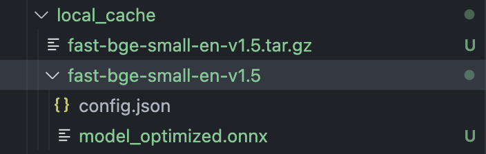
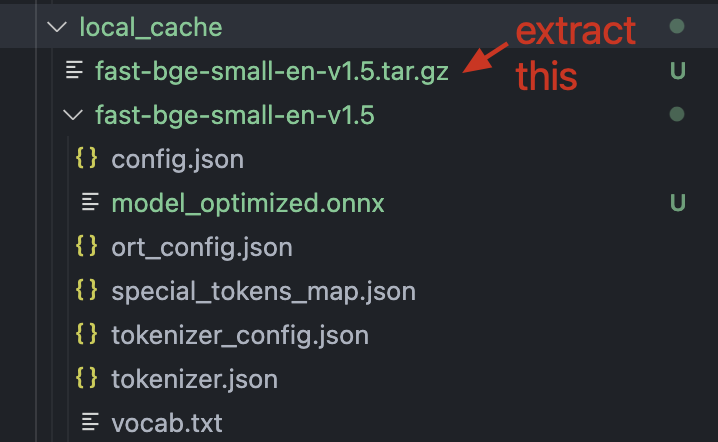

# Semantic Router JS

A semantic router using fastembed. WIP but looks like working fine.

## Installation

You can install the package using npm:

```bash
npm install @malipetek/semantic-router
```

```bash
yarn add @malipetek/semantic-router
```

```bash
pnpm add @malipetek/semantic-router
```

## Usage
```javascript
import semantic from'@malipetek/semantic-router';
// mimicing express syntax not very useful tho
const app = semantic();

app.on('toolcall', [
  'use the tool',
  'retrieve data from database',
  'look up from files',
  'read the file'
], () => {
  console.log('A tool was called');
});

  await app.route('we need to query database for this information, we might need to use a tool'); // callback gets called
```
Alternate usage:
```javascript
import semantic from'@malipetek/semantic-router';
// mimicing express syntax not very useful tho
const app = semantic();

app.on('toolcall', [
  'use the tool',
  'retrieve data from database',
  'look up from files',
  'read the file'
]);

  const result = await app.route('we need to query database for this information, we might need to use a tool'); 

  console.log(result); // result will be Route onject with name, do whatever you want with it
  /**
   * {
   *  name: 'toolcall',
   *  data: [
   *    'use the tool',
   *    'retrieve data from database',
   *    'look up from files',
   *    'read the file'
   *  ]
   * }
   */
```
## FastEmbed unzip issue
When you run router for the first time fastembed will download and unzip the model for creating vector embeddings, sometimes `tar` command fails to unzip all files in the archive. This is a known issue.

If you encounter this error, look up `local_cache` folder in your project directory. If the folder next to the `tar.gz` file only has 2 files, delete the folder and unzip the tar.gz manually.
```
throw new Error(`Tokenizer file not found at ${tokenizerPath}`);
```
Faulty folder:


Correct folder:


### Warning
Do not forget to add `local_cache` folder to .gitignore, it aint small:
  